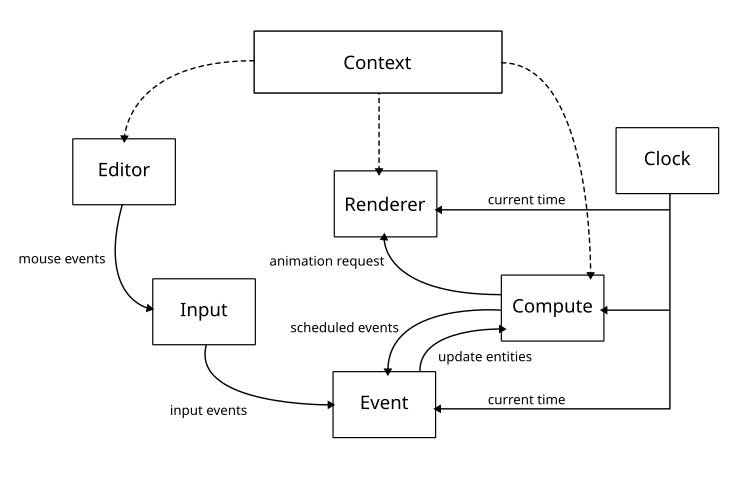

# vkApp

## Application Flow with Ownership in Mind

Here’s a high-level overview of how everything fits together:

1. Startup
    * VulkanContext is initialized (instance, device, swapchain, render pass, depth resources).
    * PipelineManager loads and compiles shaders into graphics & compute pipelines.
    * ResourceManager loads meshes & textures.
    * Renderer creates framebuffers, command buffers, and synchronization objects.

2. Per Frame
    * Acquire swapchain image.
    * Reset command buffer.
    * Record command buffer:
    * Bind render pass.
    * Bind descriptor sets (via DescriptorAllocator).
    * Draw meshes (via ResourceManager).
    * Submit command buffer to GPU.
    * Present swapchain image.

3. Shutdown
    * Destroy Vulkan resources in reverse order (first small objects like pipelines, then big ones like swapchain, device, instance).

# Architecture
The goal architecture of the application is as follows. A global context handles the Vulkan instance and devices.


```c++
    GLFWwindow* m_window;

    // context
    VkInstance instance;
    VkDebugUtilsMessengerEXT debugMessenger;
    VkSurfaceKHR surface;
    VkPhysicalDevice physicalDevice = VK_NULL_HANDLE;
    VkDevice device;
    VkQueue graphicsQueue;
    VkQueue computeQueue;
    VkQueue presentQueue;

    // swapchain
    VkSwapchainKHR swapChain;
    std::vector<VkImage> swapChainImages;
    VkFormat swapChainImageFormat;
    VkExtent2D swapChainExtent;
    std::vector<VkImageView> swapChainImageViews;
    std::vector<VkFramebuffer> swapChainFramebuffers;

    // graphics
    VkRenderPass renderPass;
    VkPipelineLayout pipelineLayout;
    VkPipeline graphicsPipeline;

    // compute
    VkDescriptorSetLayout computeDescriptorSetLayout;
    VkPipelineLayout computePipelineLayout;
    VkPipeline computePipeline;

    // command
    VkCommandPool commandPool;
    std::vector<VkCommandBuffer> graphicscommandBuffers;
    std::vector<VkCommandBuffer> computeCommandBuffers;

    // buffer
    std::vector<VkBuffer> shaderStorageBuffers;
    std::vector<VkDeviceMemory> shaderStorageBuffersMemory;
    std::vector<VkBuffer> uniformBuffers;
    std::vector<VkDeviceMemory> uniformBuffersMemory;
    std::vector<void*> uniformBuffersMapped;

    // descriptorSet
    VkDescriptorPool descriptorPool;
    std::vector<VkDescriptorSet> computeDescriptorSets;

    // synchronization
    std::vector<VkSemaphore> imageAvailableSemaphores;
    std::vector<VkSemaphore> renderFinishedSemaphores;
    std::vector<VkSemaphore> computeFinishedSemaphores;
    std::vector<VkFence> inFlightFences;
    std::vector<VkFence> computeInFlightFences;
```
